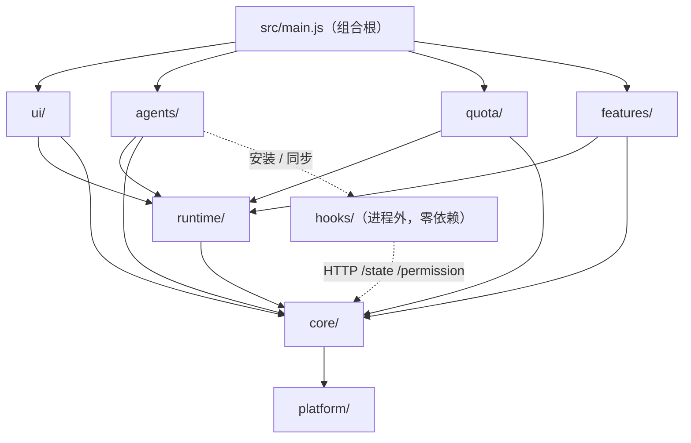

# 代码分层（已落地的目录分层 + 后续解耦计划）

> 状态：目录分层已完成（`refactor/layering`：`af4af0ef` src、`b3add0c2` test、`b655fa93` hooks），行为不变，`npm test` 与分层前一致（12614 个用例，仅 `test/repo/repository-pr-history-audit.test.js` 7 个环境性失败）。
> 前提：本 fork 独立维护，不再合并上游；上游文件可以自由移动和重构。

## 1. 目录约定

```text
src/
├── main.js                        # 组合根，唯一留在 src/ 根的文件
├── core/                          # 通用基础设施
│   ├── settings/                  # prefs / store / controller / actions / effect-router / ipc
│   ├── i18n/  log/  shortcuts/  util/
│   └── server/                    # HTTP hook 入口（/state、/permission 路由）
├── platform/{mac,win,linux,koffi} # 平台适配
├── runtime/                       # 与具体 agent 无关的领域逻辑
│   ├── state/  session/(automation/)  permission/  focus/  recap/  visual/
├── agents/                        # agent 模块
│   ├── registry.js gate.js runtime-main.js integration-sync.js installation-detector.js …
│   ├── doctor/                    # 跨 agent 的 Doctor 检测
│   └── <agent-id>/descriptor.js   # 每个 agent 一个目录：描述 + 专属逻辑（codex/turn-fence.js …）
├── quota/                         # 额度：usage-collector、sources/、alerts、ring、tray-lines、account-store
├── features/<name>/               # 可选功能：remote-ssh wsl telegram feishu slack discord mobile
│                                  #   themes(official/) codex-pet roam accessories updater doctor tutorial anim-overrides
└── ui/                            # 窗口与渲染
    ├── pet/  hud/  dashboard/  bubbles/  menu/
    └── settings/(tabs/)
hooks/
├── shared/                        # server-config、json-utils、shared-process、pid-cache、preflight、materializer …
└── <agent-id>/                    # 该 agent 的 hook 脚本、安装器、插件目录（opencode 家族含 MiMo 共用 hooks/opencode/）
test/<layer>/<area>/               # 与 src/hooks 对应；test/helpers、test/fixtures、test/fakes 为共享夹具
```

命名：目录已表达的前缀从文件名里去掉（`src/codex-turn-fence.js` → `src/agents/codex/turn-fence.js`）。`hooks/` 例外：文件名是写进用户配置的归属 marker，一律保持原名。

## 2. 依赖方向



1. 只向下依赖；`agents/`、`quota/`、`features/` 之间不互相 require（现有例外见 §4）。
2. `hooks/` 不 require `src/`；`src/` 可以 require `hooks/`（安装器、共享解析器）。
3. 渲染端 classic script 由所在 html 用相对路径引入；文档相对的资源基址（主题 / 配件 SVG）统一是 `../../../assets/…`、`../../../themes/…`。

## 3. 分层带来的对外契约变化与兼容

| 位置 | 变化 | 兼容处理 |
| --- | --- | --- |
| 用户 agent 配置里的 hook 命令 | 路径从 `hooks/<name>.js` 变为 `hooks/<agent-id>/<name>.js` | 各安装器按 basename marker 识别，启动同步时原地改写；严格按路径判归属的 Claude statusline、Cursor、MiniMax 额外接受一次分层前的平铺路径（`preLayeredHookPath`）。本机实测：Claude hooks、statusline、Codex 启动器均已改写 |
| Remote SSH 远端 `~/.claude/hooks/` | 改为同样的分层目录 | `HOOK_FILES` 为相对路径；部署时 `mkdir -p` 子目录、按 basename 从 staging 提升到分层路径，再删除旧的平铺副本；卸载优先分层安装器、找不到时回退平铺副本；监控停止同时匹配两种路径。已部署的远端需在 Settings 里重新 Deploy 一次 |
| WSL `~/.claude/hooks/` | 改为同样的分层目录 | 安装脚本、探针为分层路径；卸载先找分层脚本再回退平铺 |
| AppImage 物化目录 | `<generation>/<agent-id>/<entry>.js`，marker 在 generation 根 | 依赖预检与物化器以 `hooks/` 为边界；旧的 2 段物化路径与 FUSE 挂载平铺路径仍判为自有 |
| 部署运行时文件 | 仍在 hooks 根（identity、host prefix、secure marker） | `hooks/shared/server-config.js` 向上一级解析 |
| 打包 | 去掉 `agents/**/*`（描述并入 `src/agents/`，opencode 家族契约移到 `hooks/opencode/opencode-family.js`） | `hooks/**/*` 仍整体 asarUnpack |

## 4. 后续解耦（未做）

目录分层只移动了文件；以下逻辑耦合仍在，按优先级处理：

1. **通用文件里的 agent 分支**：49 个非 agent 目录的文件含 agent id 字面量分支，集中在 `runtime/state/state.js`（Codex 退出探测与 turn fence、Claude 身份复用）、`core/server/route-permission.js`（每个 agent 一套权限入口）、`core/server/route-state.js`（上下文用量来源、Kimi / DSH 特判）、`runtime/permission/permission.js`（重复的显示名表、远程富审批名单）、`agents/runtime-main.js`（Codex 官方 hook 仲裁、WorkBuddy / Qoder 标题读取）。做法：给 `src/agents/<id>/` 增加可选适配器，通用文件只查表调用。

```js
// src/agents/<id>/adapter.js（可选，按需出现）
module.exports = {
  integration: { sync, repair, doctorChecks },        // 取代 integration-sync.js 里的 id→函数表
  ingest:      { normalizeState, completionProtocol, turnFence },
  permission:  { route },                             // 取代 route-permission.js 里的 per-agent 分支
  sessionMeta: { titleReader, contextUsageSource },
  usage:       { source },                            // 取代 quota/sources 的硬编码清单
};
```

2. **展示面扩展点**：托盘菜单分组（`ui/menu/menu.js` 的 `joinGroups([...])`）、Session HUD 分段（`ui/hud/session-hud.js` 的 `computeHudBoxHeight({ sessionRows, quotaRows })` 与 html 里固定的两个 div）、设置侧栏（`ui/settings/renderer.js` 的 `SIDEBAR_TABS`）、设置副作用（`core/settings/effect-router.js` 的 `if (key in changes)` 链）都是硬编码。做法：改成「内置项 + 模块贡献」列表，模块（agents、quota、stats）通过同一组扩展点挂载。
3. **`main.js` 组合根**：6300+ 行、100+ 个设置镜像变量。随第 2 条把各模块的 ctx 组装移到模块自己的 `create(services)` 里。

## 5. Stats 系统监控的位置

- 目录：`src/stats/`，与 `src/agents/` 平级（采集调度、数据源适配器、托盘分组、HUD 悬停分组、设置 tab），测试放 `test/stats/`。
- 数据源：本机 `stats` fork 在 `127.0.0.1` 提供 JSON 快照（Reader 回调处导出、按需编码）；适配器接口保留 `node-native` 自采的替换位。
- 挂载：先用现有硬编码位置接入（托盘分组、HUD 第三段、设置 tab），第 4.2 条的扩展点落地后再迁成模块贡献。
